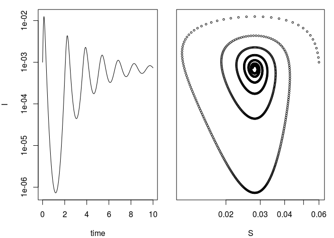

# SIR Models
Brian High  
4/4/2018  

## Load Packages

Load the *deSolve* package in order to use the `lsoda()` function.


```r
library(deSolve)                          # deSolve library needed for this computing session
```

## Define SIR Model Function


```r
sir.model <- function (t, x, params) {    # here we begin a function with three arguments
  S <- x[1]                               # create local variable S, the first element of x
  I <- x[2]                               # create local variable I
  R <- x[3]                               # create local variable R
  with(                                   # we can simplify code using "with"
    as.list(params),                      # this argument to "with" lets us use the variable names
    {                                     # the system of rate equations
      dS <- mu*(1-S)-beta*S*I
      dI <- beta*S*I-(mu+gamma)*I
      dR <- gamma*I-mu*R
      dx <- c(dS, dI, dR)                 # combine results into a single vector dx
      list(dx)                            # return result as a list
    }
  )
}
```

## Define Variables


```r
times <- seq(0, 10, by=1/120)                  # function seq returns a sequence
params <- c(mu=1/50, beta=1000, gamma=365/13)  # function c "c"ombines values into a vector
xstart <- c(S=0.06, I=0.001, R=0.939)          # initial conditions
```

## Compute Result


```r
out <- as.data.frame(lsoda(xstart, times, sir.model, params)) # result stored in dataframe
```

## Plot Phase Portrait


```r
op <- par(fig=c(0, 0.5, 0, 1), mar=c(4, 4, 1, 1))                     # set graphical parameters
plot(I~time, data=out, type='l', log='y')                             # plot the I variable as a line
par(fig=c(0.5, 1, 0, 1), mar=c(4, 1, 1, 1), new=T)                    # re-set graphical parameters
plot(I~S, data=out, type='p', log='xy', yaxt='n', xlab='S', cex=0.5)  # plot phase portrait
```

<!-- -->

```r
par(op)                                                               # re-set graphical parameters
```
